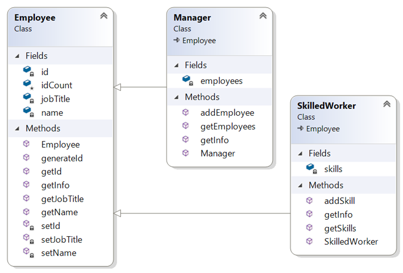

Lab 08

Polymorphism

Lab: Inheritance – Towards polymorphism
Objective
The primary objective for this lab is to enable you to derive new types and to override functionality.

Overview
Read the instructions below and critically evaluate each code sample.

Part 1 – Racing cars
Scenario
You are going to work with a project which consists of a Car class, a RacingCar class, and a Program (test) class that fills an ArrayList<Car> with Car and RacingCar objects.
The Program class will then process each Car, setting their initial speeds to 60MPH (this is done using a blatant cheat that normal cars don’t usually possess – a getToSixty() method). The test will then continue by making each ‘Car’ accelerate for two seconds before writing their model and speed to the Console.
If the car is a RacingCar we will need to add some additional code to the Program class so that a little extra information is written out.

Step-by-step

1. Open the labs project.
2. Add a class called Program with a main() method in a new package called lab8.
3. Add a class called Car to the lab8 package.
4. Add another class called RacingCar which extends Car.
5. The Car and RacingCar classes will have the fields and methods as seen in the class diagram below.
6. You will also need to add constructors for the two classes.
   Please study the diagram below before writing code.
   Please also note that any method shown below with the same name as the class is the constructor for that class.

7. Add code to the Car class.
   Create getters and setters for the model and speed fields.
   The getToSixty() method just sets the speed field to 60.
   The accelerate method should look like void accelerate(int seconds)
   and increase the speed by 5 \* seconds.
8. Create a suitable constructor for the Car class.
9. Add extra code to the RacingCar class.
   Add a String driver field with getters and setters.
   Add an int turboFactor with getters and setters.
10. You'll have to create a suitable constructor for the RacingCar class.
11. The accelerate() method will invoke the base class (Car) accelerate method and then multiply the speed by the turboFactor.
    Tip: Use the super.accelerate() method.
12. The main() method should create an array of Cars comprising of a few cars and racing cars.
13. The main() method should then pass the cars array to a method called processCars.
    The processCars method currently:
    • Gets each ‘Car’ up to 60MPH as a start point
    • Then accelerates each Car for 2 seconds
    • And displays details of each car.
    • You'll also display the driver's name but only if a Car in the array is a RacingCar.
    • You’ll need to inspect the type of each car in the array. If the car is an instance of RacingCar, cast it to the RacingCar type to access and retrieve the driver’s name.

Tip: Use instanceof like: if (c instanceof RacingCar) {….}
where 'c' is a car element in the array.

Part 2 – Employee hierarchy
Scenario
In these labs, you will design and create a class hierarchy for an employee tracking system.

Designing the hierarchy

1. Create the following classes. The employee class is provided below. Just copy and paste. We'll need you to concentrate on the other two classes.
   
2. The Manager class holds an ArrayList<Employee> called employees.
3. The addEmployee(Employee emp) method adds the emp object to the employees ArrayList.
4. The getInfo() method of the Manager should first gather the manager's details (using super.getInfo()) and then use a for-loop to go through the employees ArrayList in order to call their getInfo() method.
   It should then return the resulting string.
5. The SkilledWorker has an ArrayList <String> called skills which holds the names of skills possessed by a SkilledWorker instance.
6. The addSkill(String skill) method adds the skill String to skills.
7. In the main() method:
   a) create a Manager instance.
   b) create a few regular Employee instances and add them to the manager's employees ArrayList.
   c) create a SkilledWorker object with a few skills and then add the instance to the Manager's employee ArrayList.
   d) call the manager's getInfo() method and display the result.
   Question: Can we add a manager instance to a manager's employees?

** End **
To get you started, here is the code for the Employee class:

```java
public class Employee {
private String name;
private String jobTitle;
private int id;
protected static int idCount;
public String getName() { return name; }
private void setName(String name) { this.name = name; }
public String getJobTitle() { return jobTitle; }
private void setJobTitle(String jobTitle) { this.jobTitle = jobTitle;}
private void setId(int id) { this.id = id; }
public int getId() { return id; }
public Employee(String name, String jobTitle ) {
setId(++Employee.idCount \* 10);
setName(name);
setJobTitle(jobTitle);
}
public String getInfo() {
String info = "\n\***\* \*\*\***";
info += "Name: " + getName() + "\n";
info += "Job Title: "+ getJobTitle() + "\n";
info += "Employee ID: "+ getId()+ "\n";
return info;
}
}
```
