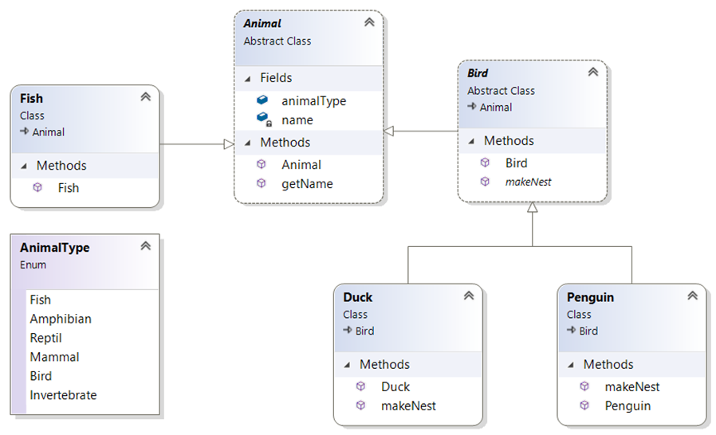

Lab 09

Abstract classes
 
Lab: Object-oriented code – Abstract classes

Objective 
The primary objective of this lab is to provide you with the skills necessary to be able to:
•	create and work with abstract classes.

Part 1
In the previous lab, it does not make sense to create an object of type Shape.
Please mark the Shape class as abstract and then run your code. 

Part 2
You are going to have Penguins, Ducks, and Fish in a collection. 
Penguins and Ducks will be derived from the Bird class. We have decided that ‘Bird’ is too abstract for what we want.
The class diagram after completing the lab can be seen below. 

 

Step by step
1. Create a new class called Program with a main() method in a package called lab9.

2. Add the following classes to the lab9 package:
Animal, 
Bird, 
Fish, 
Duck

3. Create an enum to define a few animal types:
```java
enum AnimalType {
	 Fish,
	 Amphibian,
	 Reptil,
	 Mammal,
	 Bird,
	 Invertebrate
}
```
4. Add code to the Animal class.
a)	Make this class abstract.
b)	Add a field to define the type, like:
AnimalType animalType;
c)	Add a field called name with getName() method.
d)	Provide this class with a constructor to set the animal’s name.

5. Add code to the Bird class. 
a)	Make this class also abstract.
We want to make different kinds of birds, not a generic bird!
b)	extends the Animal class.
c)	Create a constructor to set the bird’s name. 
d)	Set the type of the animal to Bird within the constructor.
e)	Provide it with an abstract method called makeNest() because all birds make their nest in a different way. 
Tip: public abstract void makeNest();


6. Write code for the Duck class.
a)	extends Bird.
By default a Duck will also be an Animal (Bird extends Animal).
b)	You'll need to provide a constructor because the super class (Bird) has constructor with a String parameter to set the name.
c)	Implement the makeNest() method (just print a message)

7. Write code for the Penguin class.
a)	extends Bird.
b)	Provide a constructor similar to the Duck class.

8. Create a class called Fish and set its name and type using a constructor.
Feel free to give the fish other methods like swim().

9. Open class Program. 
a)	Create an array/ArrayList of Animal called animals.
Place different Animal instances in the array.
b)	Write an enhanced ‘for’ loop that iterates over the animals.
This is an example of Polymorphism. 
c)	Every Fish, Penguin, and Duck can be referred to as an Animal and can therefore be placed in a collection of type Animal.
10. Run your code to make sure it works.
11. How would you detect if an animal in the list is a Bird and how would you then call its makeNest() method?
12. Add another animal type if you have time.

** End **
 

