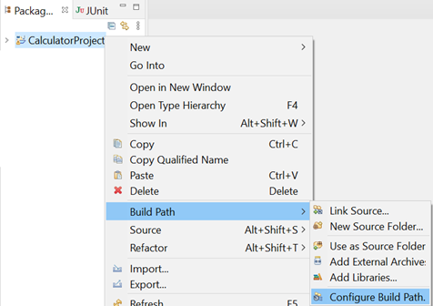
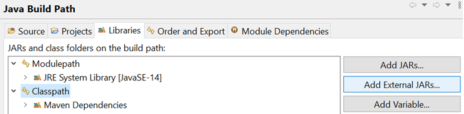
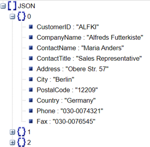

<h1>Lab 12</h1>

Accessing files

Lab: Working with files

Objective
The objective of this practical session is for you to:
• become familiar with a number of classes found in the java.io namespace.
• practice reading and writing to files.

Part 1 – File I/O practice

1. Back in the labs project, add a new class called Program with a main() method in a package called lab12.
2. Add three pre-supplied text files to your src folder (see the resources folder).
   course.txt
   trainer.txt
   courseTrainer.txt
   Tip: To add these, right mouse click on the src folder and then select:
   import > general > file system
3. Create a method in the Program class with following signature:

```java
private static String[] readCSV(String inFile) throws IOException {

}
```

4. Implement the readCSV method to read a single line from the inFile parameter.
   Use the split method to divide the resulting String based on commas (,) as the delimiter. Finally, return the resulting String[ ].
5. Back in main(), call the readCSV() method and pass it the ‘src/course.txt’ as file name and capture the result back in a variable called courses.
   Do the same for ‘src/trainer.txt’ and capture the result in a variable called trainers.
6. Create a file called trainersAndCourses.txt and append the courses and trainers arrays to this file on separate lines (\n).
7. Run your code and make sure it works.

Part 2 – Reading JSON files

1. In this part of the exercise, you'll write code to read a JSON file and parse its contents to extract an array of customers stored within it. Start by creating a new project or adding a new class to an existing Java project to handle the reading and processing of JSON data. This will help you understand how to work with JSON data in Java and manage structured data effectively.
2. Before you can use the Gson module, you need to import it. Please follow these steps.
   Right mouse click on your project and then select the Build Path > Configure Build Path options.



3. Select the Class path option and then click the Add External JARs… button. Select the provided gson-2.6.2.jar file in the resource folder.
   Click the Apply and Close button to complete the import.



View the provided customers.json file (in the resources folder) in an online JSON viewer (such as http://jsonviewer.stack.hu/) and you’ll see that it contains an array of customer object.



You’ll soon read the customer data and create an array of customers.
Therefore, you’ll need to create a simple customer class like:

```java
class Customer {
String CustomerID, CompanyName, ContactName, ContactTitle;
String Address, City, Region, PostalCode, Country;
}
```

Typically, you would declare these fields as private and use your IDE to automatically generate getters and setters for them. However, for the purpose of this exercise, we'll keep the fields package-private to stay focused on the main topic without delving into access modifiers or encapsulation details.

Please copy the following code to your main() method or create another method to house it.
(Please modify the customers.json path in the code below.)

```java
public static void main(String[] args) throws Exception{

    Gson gson = new Gson();

    String fileName = "C:\\qa\\customers.json";

    String content = new String(Files.readAllBytes(Paths.get(fileName)));

    Customer[] customers = gson.fromJson(content, Customer[].class);

    System.out.println(customers[0].CustomerID);

}
```

The code above prints the CustomerID of the first customer, with the field name precisely matching the spelling used in the customers.json file. To display additional customer data, modify the code to include a loop that iterates through the array of customers and prints their CustomerID values. This will ensure all customer details are processed efficiently.

4. Run the code to test it.
   Please refer to next page to see how to stringify and object to JSON string and how to parse a JSON string to Java object.
   Writing objects as JSON
   How would you write a single object to a file?
   How about a List of objects?

Below is a sample code to get you started:

```java
Gson gson = new Gson();

int[] nos = {1,3,5,7,9};
String res = gson.toJson(nos);
System.out.println(res);

String[] names= {"Bob","Fred","Wilma"};
res = gson.toJson(names);
System.out.println(res);

Student[] students = {
new Student("Bob",21),
new Student("Fred",32),
new Student("Wilma",26)
};

res = gson.toJson(students);
System.out.println(res);

//-----------------------------------

class Student{
String name;
int age;
ArrayList<String> subjects = new ArrayList<>();

public Student(String name, int age) {
this.name = name; this.age = age;
subjects.add("Java");
subjects.add("C#");
subjects.add("Network");
}
}
```

** End **
